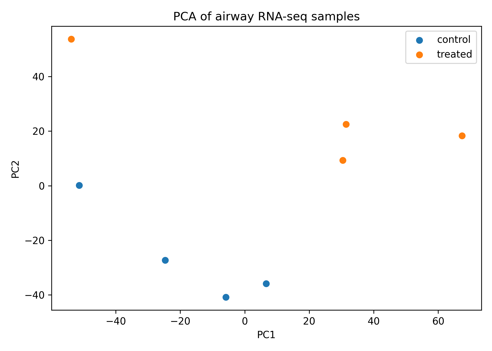
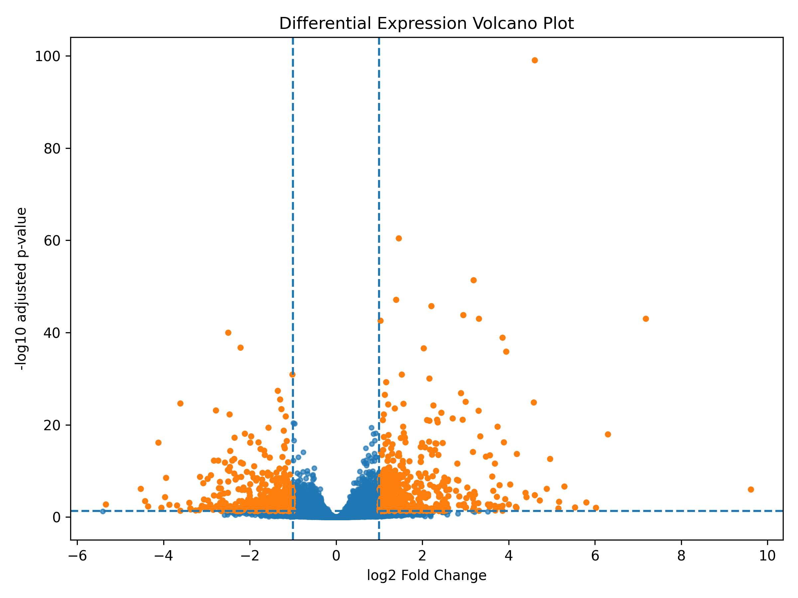

#airway notes

-loads public RNA-seq count data,
-runs differential expression analysis,
-generates visualizations,
-and exports reproducible results.

## Dataset:
Himes et al. 2014 airway RNA-seq dataset (GSE52778)

## Run

Install dependencies:

```bash
pip install -r requirements.txt
```

Download dataset:

```bash
python scripts/ddata.py
```

Run analysis:

```bash
python scripts/run_analysis.py
```

---

## Results

### PCA



### Volcano Plot



---

## Notes

RNA-seq workflow built to better understand differential expression analysis and reproducible scientific pipelines using real biological data.